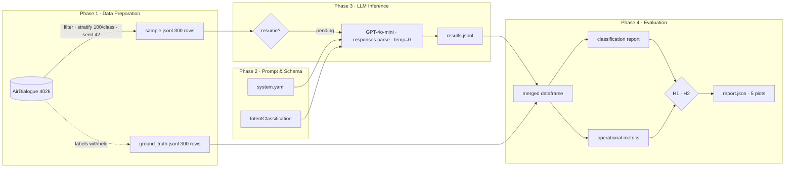

# Pipeline Implementation

**Zero-Shot Intent Classification via Schema-Enforced Structured Output**
*Technical implementation reference for the AirDialogue PoC*

---

## Architecture Overview

The pipeline follows a strict four-phase sequential design. Each phase produces a durable artefact that the next phase consumes. Phases are isolated: re-running Phase 4 never modifies Phase 3 output, and Phase 3 can be interrupted and resumed without re-processing completed records.



---

## Phase 1 — Data Preparation

### Source

The Google AirDialogue dataset is loaded from HuggingFace (`google/air_dialogue`, config `air_dialogue_data`, `train` split). The full split contains 402,038 records.

### Filtering

Two sequential filters are applied before sampling:

1. **Quality filter:** Only records where `correct_sample == True` are retained. This field is part of the original AirDialogue annotation and flags records the dataset authors considered well-formed. Records failing this check are discarded entirely.
2. **Class filter:** Only records whose `intent["goal"]` field takes one of the three valid values — `book`, `change`, `cancel` — are retained. This removes any malformed or out-of-vocabulary intent values.

### Stratified Sampling

A stratified random sample of 300 conversations is drawn with exactly 100 records per intent class, using a fixed random seed (`seed = 42`). This ensures class balance in evaluation and full reproducibility of the sample across runs.

### Label Separation

The sample is split into two separate files at write time:

- **`sample.jsonl`** — contains only `id` and `dialogue` (the raw multi-turn conversation text). This is the sole input to Phase 3; no label information is present.
- **`ground_truth.jsonl`** — contains only `id` and `goal` (the true intent class). This file is withheld and not accessed until Phase 4 evaluation.

The `id` field is a zero-padded index derived from the record's original position in the dataset, used as the join key between phases. The dialogue is pre-formatted as a sequence of speaker-prefixed turns (e.g. `customer: I'd like to change my flight.`), concatenated into a single string.

---

## Phase 2 — Prompt Design and Output Schema

### System Prompt

The system prompt is stored in `prompts/system.yaml` and loaded at runtime. It defines two tasks:

**Task 1 — Intent classification.** The model is instructed to determine what the customer intended to accomplish *at the start of the conversation*, using only the three valid classes (`book`, `change`, `cancel`). The prompt includes an explicit instruction to classify intent rather than outcome: some AirDialogue dialogues end without resolution (e.g. the agent finds no available flights), and without this instruction the model could conflate the negative outcome with a cancellation intent. This is the critical design decision for classification fidelity on this dataset.

**Task 2 — Sentiment classification (exploratory).** The model is asked to assess the customer's overall sentiment (`positive`, `neutral`, `negative`). This field is captured in the output schema but not evaluated against any ground truth, as AirDialogue provides no sentiment annotations. It is included for potential exploratory use.

No labeled examples are provided anywhere in the prompt. This is a strict zero-shot condition.

### Output Schema

The output contract is defined as a Pydantic v2 model (`IntentClassification`) with two fields:

| Field | Type | Constraint |
|---|---|---|
| `predicted_intent` | `str` | Must be exactly one of: `book`, `change`, `cancel` |
| `customer_sentiment` | `str` | Must be exactly one of: `positive`, `neutral`, `negative` |

Both fields use `Literal` type constraints. Any value outside the allowed set causes Pydantic validation to raise a `ValidationError`, which is caught and logged as a schema failure. The schema is passed directly to the OpenAI API as the `text_format` parameter of the Responses API, enabling server-side structured-output enforcement before the response even reaches the application layer.

---

## Phase 3 — LLM Inference

### API Call Design

Each conversation is processed as an independent, stateless API call via the OpenAI Responses API (`client.responses.parse`). No context is shared between conversations. Each call consists of:

- **Instructions:** the zero-shot prompt from Phase 2, passed as the `instructions` parameter
- **Input:** the full dialogue text from `sample.jsonl`, passed as the `input` parameter
- **Model:** `gpt-4o-mini`
- **Temperature:** `0` — enforces deterministic, greedy decoding; eliminates generative variance as a confound
- **Output format:** the `IntentClassification` Pydantic model, passed via the `text_format` parameter

The `responses.parse` endpoint is OpenAI's structured output mode on the Responses API. It constrains the model to return a JSON object conformant with the provided schema and exposes the already-parsed Pydantic instance via `response.output_parsed`. This means schema validation occurs at two layers: the API enforces JSON structure, and Pydantic validates field values against the `Literal` constraints. Token usage is read from `response.usage.input_tokens` and `response.usage.output_tokens` (the Responses API naming) and recorded as `prompt_tokens` / `completion_tokens` in the output rows.

### Resume Logic

Before processing begins, the pipeline reads `results.jsonl` (if it exists) and extracts all `id` values already present. Any record whose `id` is already in the results file is skipped. This allows an interrupted run to continue from the last completed record without reprocessing or duplicating calls. Results are written and flushed to disk after every single call, so a crash loses at most one record.

### Error Handling

Rate limit errors (`RateLimitError`) trigger a 30-second backoff followed by a single retry. All other exceptions are caught, logged to the `error` field of the result row, and marked as `schema_valid = False`. Schema failures do not halt the pipeline.

A fixed 500ms sleep between calls is applied to stay within API rate limits under sustained load.

### Per-Call Output

Each processed record produces one row in `results.jsonl` containing:

| Field | Description |
|---|---|
| `id` | Join key matching `ground_truth.jsonl` |
| `predicted_intent` | Classified intent (`book` / `change` / `cancel`), or `null` on failure |
| `customer_sentiment` | Classified sentiment, or `null` on failure |
| `schema_valid` | Boolean — `true` if Pydantic validation passed |
| `prompt_tokens` | Token count for the system + user message |
| `completion_tokens` | Token count for the model response |
| `cost_usd` | Per-call cost computed from published GPT-4o-mini pricing |
| `error` | Exception message if schema validation failed, otherwise `null` |

### Cost Calculation

Per-call cost is computed as:

```
cost = (prompt_tokens / 1000 × $0.000150) + (completion_tokens / 1000 × $0.000600)
```

These are the GPT-4o-mini input and output token rates at time of execution. The rates are stored in `config/config.yaml` and can be updated without code changes.

---

## Phase 4 — Evaluation

### Join and Alignment

`results.jsonl` and `ground_truth.jsonl` are loaded as dataframes and joined on the `id` field. The inner join ensures only records present in both files are evaluated, guarding against partial runs.

Schema failures are not excluded from evaluation: any record where `schema_valid = False` has its `predicted_intent` set to the sentinel value `__invalid__`, which by construction never matches any true label. This means schema failures count as misclassifications in the accuracy metrics, making the reported accuracy a conservative lower bound that includes reliability failures.

### Classification Metrics

Per-class and macro-averaged metrics are computed using scikit-learn's `classification_report`:

- **Precision** — of all predictions for a class, what fraction are correct
- **Recall** — of all true instances of a class, what fraction are identified
- **F1-Score** — harmonic mean of precision and recall
- **Macro F1** — unweighted average F1 across all three classes; the primary H1 test metric

The full confusion matrix is recorded, showing the absolute count of every true-class / predicted-class combination.

### Operational Metrics

Aggregated from the token count and cost fields in `results.jsonl`:

- Schema failure count and rate (primary H2 test metric)
- Mean prompt tokens per call
- Mean completion tokens per call
- Mean cost per call
- Total cost for the 300-call run
- Projected cost at 10,000 calls (mean cost × 10,000)

### Hypothesis Testing

| Hypothesis | Metric | Threshold | Test |
|---|---|---|---|
| H1 | Macro F1 | ≥ 0.80 | `macro_f1 >= 0.80` |
| H2 | Schema failure rate | < 5% | `schema_failure_rate < 0.05` |

Both are evaluated as binary accept/reject decisions. The results are written to `evaluation_report.json`.

### Visualisations

Four figures are generated and saved to `results/plots/`:

| Figure | What it shows |
|---|---|
| `confusion_matrix.png` | Row-normalised heatmap; diagonal = correct classifications |
| `f1_per_class.png` | Per-class F1 bar chart with the H1 threshold (0.80) drawn as a reference line |
| `token_distribution.png` | Distribution of prompt token counts across all 300 calls; illustrates cost variance |
| `cost_projection.png` | Cumulative cost as a function of call volume from 0 to 10,000 |

---

## Design Decisions and Their Rationale

| Decision | Rationale |
|---|---|
| Temperature = 0 | Eliminates generative variance as a confound; makes results fully reproducible |
| Zero-shot condition only | Establishes the most conservative and operationally realistic baseline; avoids the maintenance overhead of maintaining labeled few-shot examples across schema changes |
| Stratified sampling, fixed seed | Ensures balanced per-class evaluation and identical sample across all runs |
| Label separation at sampling time | Prevents any possibility of label leakage into the inference phase; reflects production conditions where ground truth is unavailable at inference time |
| Schema failures as misclassifications | Makes the accuracy metric a single conservative lower bound covering both classification errors and reliability failures, rather than reporting them separately and allowing cherry-picking |
| Append-and-flush result writing | Allows the pipeline to resume after any interruption without losing progress or duplicating API calls |
| Single-stage architecture | Constrains the pipeline to what is feasible in one prompt and one schema; this is also the primary structural limitation noted in the discussion |
